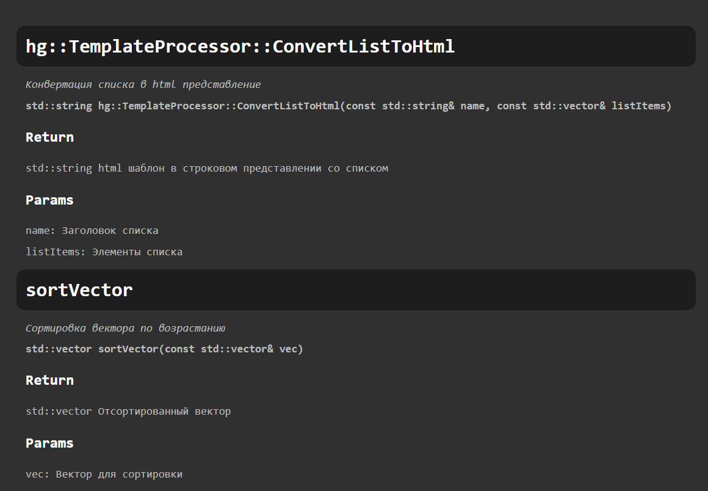

## Разработчики:

> [Архипов К.С.](https://git.csc.sibsutis.ru/ip311s03)

> [Абрамов М.В.](https://git.csc.sibsutis.ru/ip311s01)

> [Проскоков И.А.](https://git.csc.sibsutis.ru/ip311s20)

## О приложении

`CodeDocGenerator` - простой генератор документации из исходных файлов с кодом

### Функционал

 - Создание файлов `html` и/или `txt` с документацией из предоставленного кода на языке `C/C++` и др.
 - Возможность выбора наимненования исходного файла и заголовка в документации `html`

### Поддерживаемые комментарии и тэги

Комментарии: 
``` C++
/// Пример комментария с документацией
```

Тэги:
``` C++
/// @brief      Краткое описание
/// @param a    Описание параметров
/// @param b    Описание параметров
/// @note       Заметки
/// @return     Возвращаемое значение
/// @throw      Возможные исключения
```

### Примеры

Файлы, на которых можно проверить работоспособность программы, расположены в `example/`



## Сборка и запуск

Сборка
``` Bash
git clone https://git.csc.sibsutis.ru/trpo2024/rgr-arhipov-ip311s03.git
cd rgr-arhipov-ip311s03
make

```

Использование

Эта команда создаст `html` файл с документацией из файла `example/docexample.cpp`:

``` Bash
cdg example/docexample.cpp
```

Эта команда выполнится для всех `*.cpp` файлов в текущем каталоге и подкаталогах:

``` Bash
git ls-files '*.cpp' | xargs -I {} sh -c 'cdg {}'
```

## Команды

| Команда | Аргумент      | Описание                                                                          |                 |
| ------- | ------------- | --------------------------------------------------------------------------------- | --------------- |
| Помощь  | `-h`          | Отображение подсказки по всем командам                                            | `необязательно` |
| Ввод    | `-c <путь>`   | Указание пути для входного файла с кодом                                          | `обязательно`   |
| Вывод   | `-o <путь>`   | Указание пути для выходного файла `hmtl`                                          | `необязательно` |
| Вывод   | `-f <маркер>` | Создавать текстовый файл? </br> `<маркер>` - маркер для списков (по умолч. - нет) | `необязательно` |
| Имя     | `-n <имя>`    | Указание заголовка внутри файла документации (также является именем файла)        | `необязательно` |